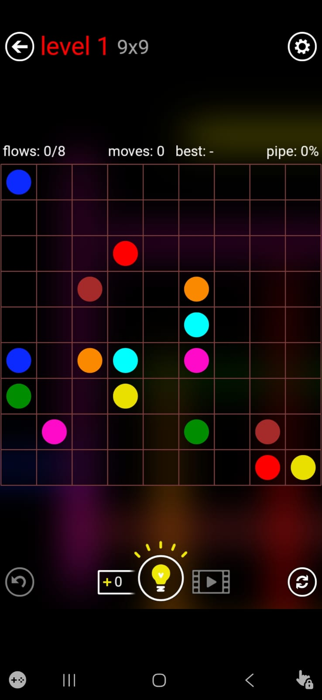
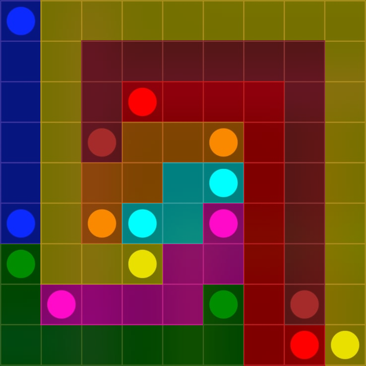

# Flow Free Solver

An automated solver for the mobile puzzle game. Given a screenshot of an unsolved puzzle, the solver automatically detects the grid, identifies colored endpoints, computes a valid solution, and renders the completed paths back onto the image.

---

## Features

* Automatic grid detection from screenshots
* Colored endpoint identification using image processing
* Backtracking solver with MRV (Most Constrained Variable) heuristic
* Visual rendering of solved paths
* Fully implemented in Python using OpenCV and NumPy

---

## How It Works

The project consists of three stages:

### 1. Parser

OpenCV is used to process the screenshot and extract puzzle information.

The parser:

* Detects and crops the puzzle grid
* Identifies grid boundaries using edge detection and Hough Line Transform
* Computes grid dimensions
* Detects colored endpoints
* Maps each endpoint to its corresponding grid cell

Output:

```python
{
    (row, col): color_id
}
```

---

### 2. Solver

The puzzle is solved using recursive backtracking.

To improve performance, the solver uses the **Most Constrained Variable (MRV)** heuristic:

* For each incomplete color path, count the number of available moves
* Select the color with the fewest legal moves
* Extend that path first
* Backtrack whenever a dead end is reached

This significantly reduces the search space compared to a naive backtracking approach.

---

### 3. Renderer

Once a solution is found:

* Each completed path is drawn onto the original puzzle image
* Semi-transparent overlays are used so the original dots remain visible
* The final solution is displayed as an annotated image

---

## Example

| Input                  | Output                            |
| ---------------------- | --------------------------------- |
|  |  |

---

## Tech Stack

* Python
* OpenCV
* NumPy

---

## Installation

```bash
pip install opencv-python numpy
```

---

## Usage

1. Place a Flow Free screenshot inside the project directory.

2. Update the filename in `main.py`:

```python
grid_img, rows, cols, cell_width, cell_height, dots, reverse_color_map = detect_grid("your_screenshot.jpeg")
```

3. Run the solver:

```bash
python main.py
```

4. The solved puzzle will be displayed in a window.

---

## Project Structure

```text
flow-free-solver/
├── parser.py
├── solver.py
├── renderer.py
├── main.py
├── 9_1.jpeg
├── 9_2.jpeg
```

### File Descriptions

| File        | Purpose                                |
| ----------- | -------------------------------------- |
| parser.py   | Grid detection and endpoint extraction |
| solver.py   | Recursive backtracking solver          |
| renderer.py | Solution visualization                 |
| main.py     | Program entry point                    |

---

## Limitations

* Performance decreases rapidly as puzzle size increases
* 10×10 puzzles may require significantly longer solve times
* Current implementation relies primarily on backtracking

---

## Future Improvements

* Constraint propagation
* Dead-end detection
* Better color classification using HSV clustering
* Support for larger puzzle sizes
* Command-line interface
* Batch solving for multiple screenshots

---

## License

This project is intended for educational and personal use
